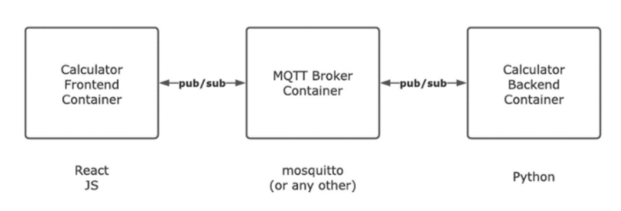

# MQTT Calculator
[](https://github.com/yusufcanb/mqtt-calculator/actions/workflows/docker-image.yml)

This project aims to perform basic arithmetic operations with pub/sub pattern.

## System Overview



## Getting Started

Clone the repository;

```
https://github.com/yusufcanb/mqtt-calculator.git
```

Run system using docker-compose;

```
docker-compose up -d
```

Open your browser and navigate to [http://localhost:3000](http://localhost:3000)

